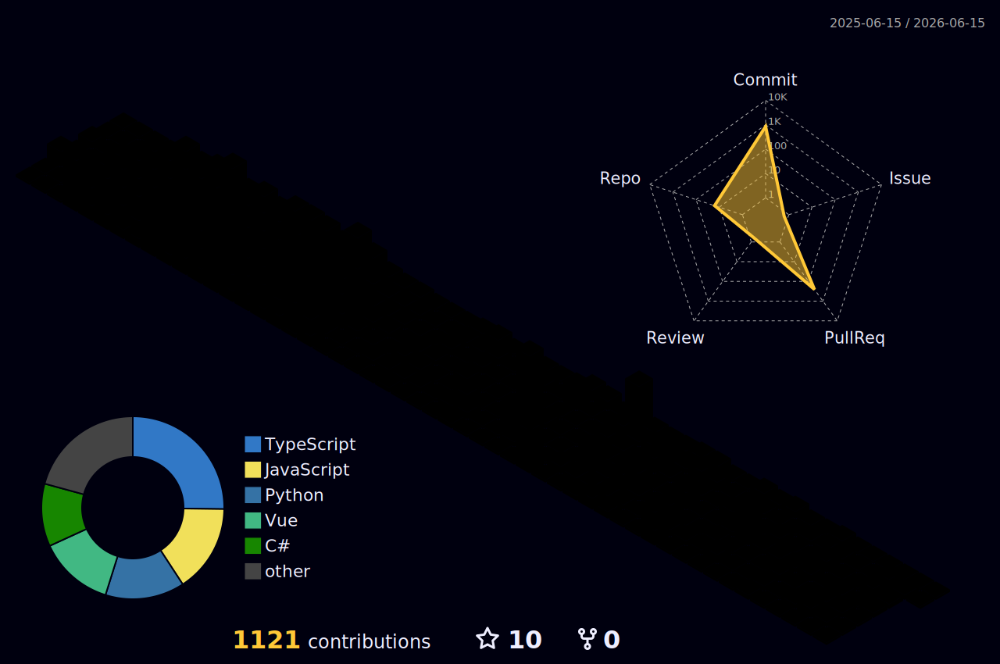

# About Me 

- Fullstack Software Developer building things for the web
- Build systems, not features
- Main machine runs **Windows**
- Best friends name is Claude

---
<!--### GitHub Stats-->
<!-- <picture>
  <source media="(prefers-color-scheme: dark)" srcset="https://raw.githubusercontent.com/DeBugger3000/DeBugger3000/output/github-snake-dark.svg" />
  <source media="(prefers-color-scheme: light)" srcset="https://raw.githubusercontent.com/DeBugger3000/DeBugger3000/output/github-snake.svg" />
  
</picture> -->

<!-- 

   
  

 -->
